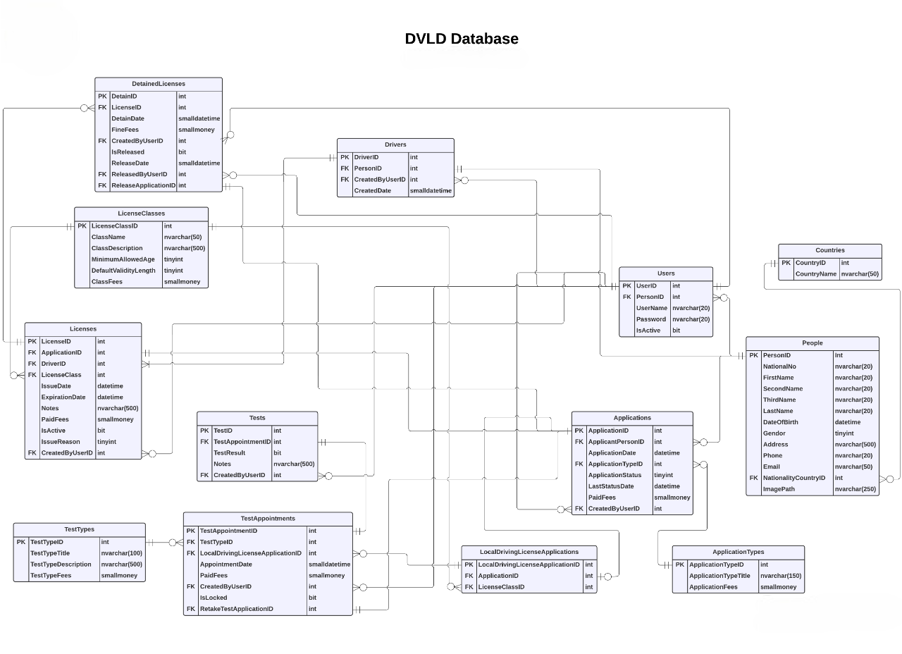
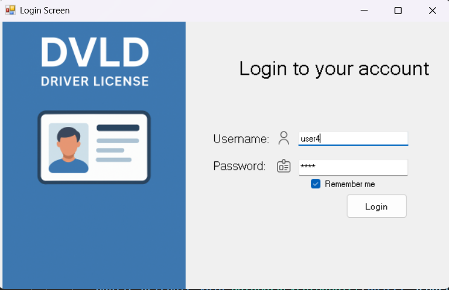
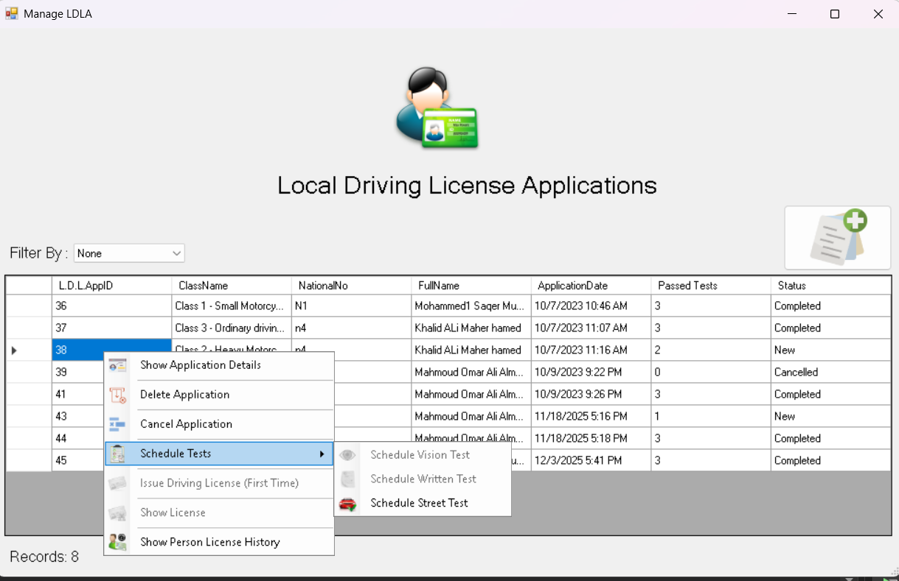
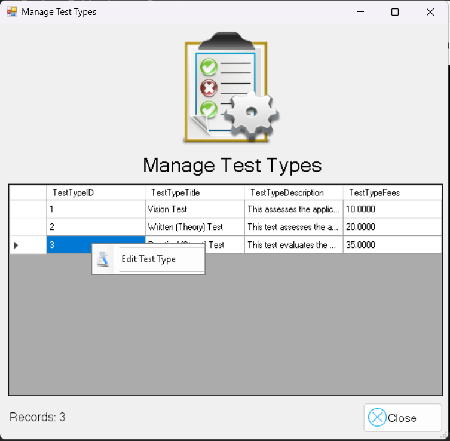
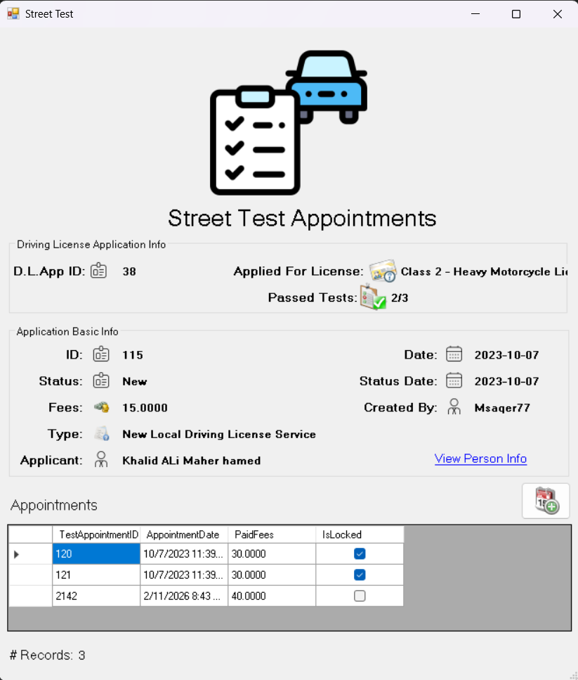

# 🚗 DVLD: Driving & Vehicle License Department System
### *A 3-Tier Management Solution for Traffic Departments*

## 📖 Project Overview
The **DVLD System** is a desktop-based enterprise solution designed to manage the comprehensive lifecycle of driving licenses. Built with a focus on **Object-Oriented Design (OOD)** and **Relational Data Integrity**, this system automates citizen registration, multi-stage testing, and specialized license services such as renewals, replacements, and international permits.

---

## 🏗️ 3-Tier Architecture
The project is strictly organized into three distinct projects to ensure a clean separation of concerns and a maintainable codebase:

* **`DVLD` (Presentation Layer):** Contains all Windows Forms and user interface logic. It interacts exclusively with the Business Layer to maintain a decoupled design.
* **`DVLD_Business` (Business Logic Layer):** The "brain" of the system. It defines core entities (e.g., `clsPerson`, `clsUser`, `clsApplication`) and enforces rules for validation, age requirements, and state transitions.
* **`DVLD_DataAccess` (Data Access Layer):** Handles raw data retrieval and persistence. It utilizes **ADO.NET** with `SqlConnection` and `SqlCommand` to interact with SQL Server safely via parameterized queries.

---

## 💾 Database Schema
The system is backed by a highly normalized relational database. Below is the Entity Relationship Diagram (ERD) representing the core tables and their associations.

 

---

## ✨ Core Feature Modules

### 👤 Identity & Security
* **Person Management:** A unified registry for all individuals. Supports searching by National ID and managing detailed personal records, including high-resolution photo storage.
* **User & Permissions:** Secure login system with a dedicated `clsUser` entity. Supports full management of system users with encrypted password logic and account status control.

### 📝 Application & Service Workflow
The system manages various application types through a dynamic service model, where each service has unique requirements and business rules:
* **New Local Driving Licenses:** Multi-step workflow specific to various license classes (Motorcycle, Regular, Commercial, etc.).
* **International Driving Permits:** Dedicated issuance logic for valid local license holders.
* **License Services:** Specialized logic for **Renewals**, **Replacements (Lost/Damaged)**, and **Release of Detained Licenses**.

### 🧪 Sequential Testing Pipeline
The system enforces a strict procedural testing logic. An applicant must pass each stage before advancing to the next:
1. **Vision Test** ⮕ 2. **Theoretical (Written) Test** ⮕ 3. **Practical (Street) Test**
* *Implementation:* Managed via `clsTest` and `clsTestAppointment` classes to track attempt history and results.

### 🚔 Enforcement & History
* **License Detainment:** A robust module to handle license suspensions, fine assignments, and the legal release process.
* **Driver & License History:** A 360-degree view of all historical applications and issued licenses associated with a specific driver.

---

## 📸 System Screenshots

| Login & Authentication | Applications Management | Main Dashboard |
| :--- | :--- | :--- |
|  |  |  |

| Application Types | Test Types | Test Management |
| :--- | :--- | :--- |
|  |  |  |

---

### 🔑 Default Login
* **Username:** `user4`
* **Password:** `1234`

---
